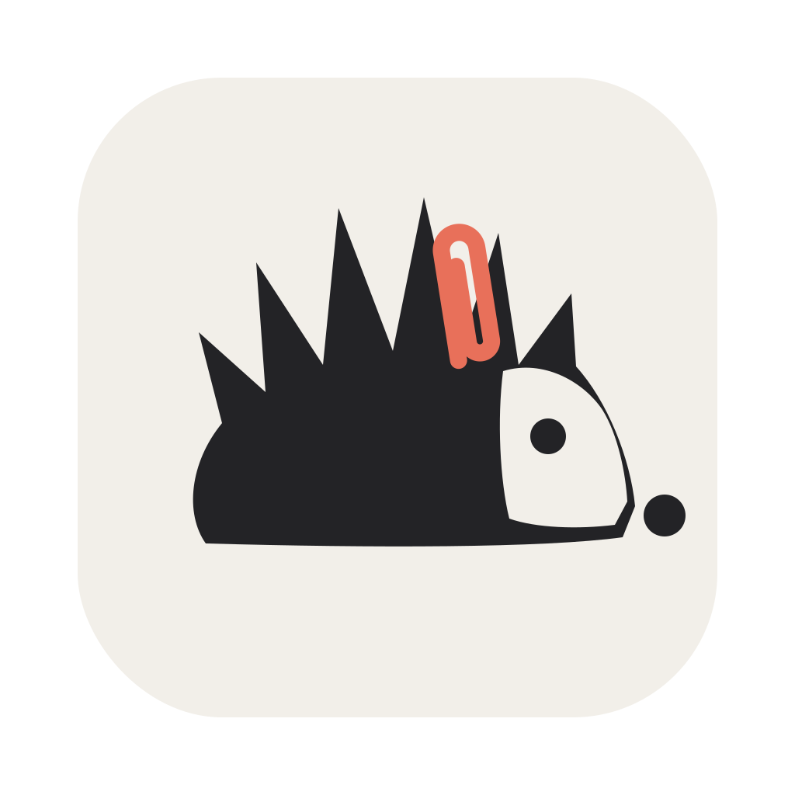
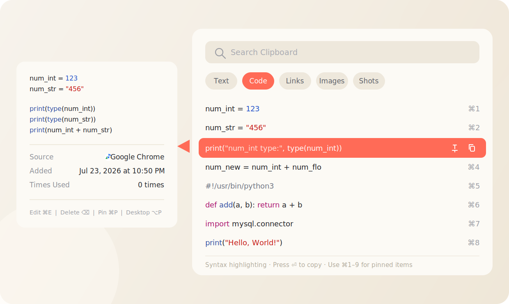
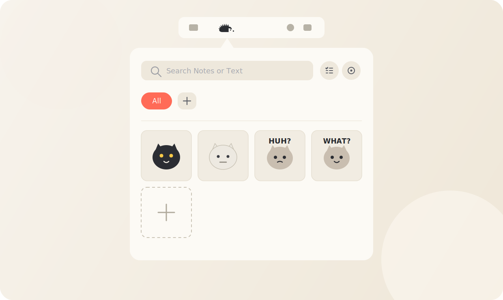
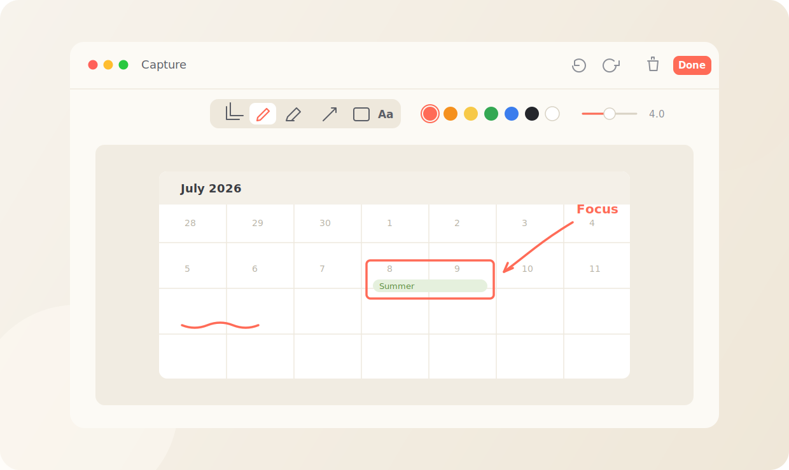
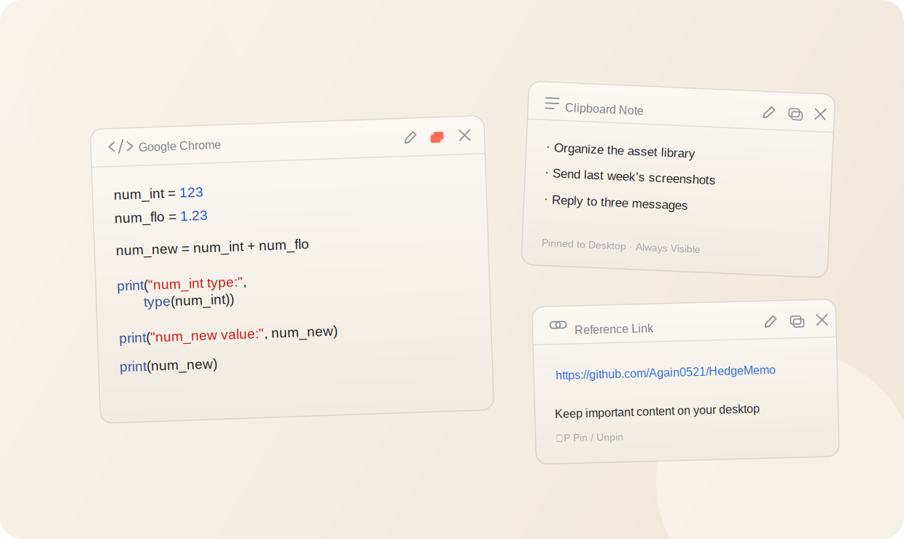
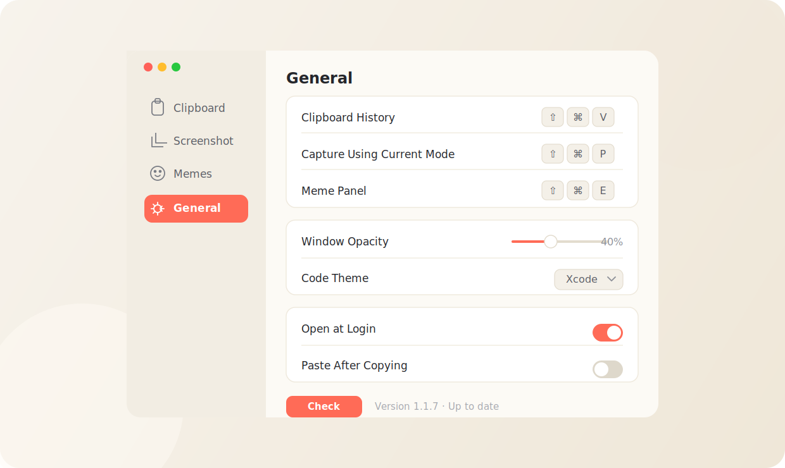

[简体中文](README.md) | [English](readme_en.md)

# HedgeMemo

**A little hedgehog in your menu bar, keeping copied content, favorite memes, and screenshots together.**

`macOS 14+` &nbsp;·&nbsp; `Stored locally` &nbsp;·&nbsp; `Menu bar app` &nbsp;·&nbsp; `Free`

[**Download the Latest Version**](https://github.com/Again0521/HedgeMemo/releases) &nbsp;·&nbsp; [Share Feedback](https://github.com/Again0521/HedgeMemo/issues) &nbsp;·&nbsp; [View the Full Introduction](Assets/HedgeMemo-introduction_en.png)

---

## Meet HedgeMemo

HedgeMemo lives in the macOS menu bar. Clipboard history, memes, and screenshot tools stay in one place—ready when you need them and quietly out of the way when you don’t.

Your content is stored on this Mac by default. HedgeMemo asks for system permission only when a screenshot or automatic paste needs it.

One app, three everyday tools: **Clipboard · Memes · Screenshots**.

## Clipboard History

### Everything you copy, ready to return

HedgeMemo keeps copied text, code, links, and images, then places them in the right categories automatically. Enter a keyword and the item you need is close at hand.

- Pin an item in the list, or keep it visible as a desktop note.
- Copy something already in the history and its original entry moves forward—no duplicate is created.
- Add clipboard images directly to the meme library. Screenshots captured by HedgeMemo remain in their own Screenshots category.
- Read code with syntax highlighting and choose the color theme you prefer.
- Turn categories on or off, rearrange them, or create custom text categories with regular expressions.
- Pause over an item to see its full contents, source, and capture time.

Add `%` to a search to find several fragments in order, even when they are separated in the original content. Once you find the item, press <kbd>⏎</kbd> or click it to copy again.

## Meme Library

### Your favorite memes, close at hand

Open the meme panel from the menu bar, or use a shortcut to place it beside the pointer. Choose a meme and the panel closes automatically, returning you to the conversation.

- Add images from files, folders, or the clipboard.
- Turn on image capture and collect copied images from other apps, even while the panel is closed.
- Keep GIF animation and the original image format.
- Organize favorites with categories, notes, and search; drag to reorder or manage several items together.
- Selectively import or export memes and clipboard content in a ZIP archive.

Memes copied from this panel are not added back to clipboard history.

## Screenshots and Markup

### Capture the screen, keep the focus

Choose a window or select any area of the screen. Use the result immediately, or crop it first and add pen strokes, arrows, rectangles, and text.

- Adjust annotation color and thickness.
- Zoom the canvas, then undo or redo at any time.
- Finished images are copied to the clipboard and saved in the Screenshots category.
- Choose whether the editor opens after capture and whether HedgeMemo remembers the last capture mode.

## Desktop Notes

### Keep what matters in sight

Any clipboard item can become a desktop note, keeping code, to-do lists, and reference links visible until you are finished with them.

- Code notes retain syntax highlighting.
- Desktop-pinned items begin at position 10 in clipboard history. When several are pinned, the first one pinned appears first.
- Press <kbd>⌥</kbd><kbd>P</kbd> to pin or unpin the selected item.

## Settings and Personalization

### Make HedgeMemo feel like yours

Adjust the language, shortcuts, code colors, scroll bars, and startup behavior in Settings. On first launch, HedgeMemo uses Simplified Chinese in Chinese language environments and English everywhere else. You can switch languages at any time.

- Record separate shortcuts for clipboard history, screenshots, and the meme panel.
- Choose how much history to keep, whether images are saved, and whether copied content is pasted automatically.
- Adjust the background opacity of panels outside the menu bar popover. At 0%, HedgeMemo keeps its clear glass effect; at 100%, it uses a fully opaque system background. Restore the default whenever you like.
- Open HedgeMemo automatically when you log in.
- Check for updates from Settings. When a new version is available, the menu bar hedgehog shows a small indicator and the version number opens the download page.

## Quick Start

1. Download HedgeMemo, move it to the Applications folder, and open it.
2. Once the hedgehog appears in the menu bar, left-click it to open the meme panel. Right-click to find screenshots, import and export, clipboard cleanup, and Settings.
3. Press <kbd>⇧</kbd><kbd>⌘</kbd><kbd>V</kbd> to open clipboard history, then choose an item to copy it again.
4. Press <kbd>⇧</kbd><kbd>⌘</kbd><kbd>E</kbd> to open the meme panel beside the pointer.
5. Open Settings and tailor the shortcuts and behavior to the way you work.

## Keyboard Shortcuts

| Shortcut | Action |
| --- | --- |
| <kbd>⇧</kbd><kbd>⌘</kbd><kbd>V</kbd> | Open clipboard history |
| <kbd>⇧</kbd><kbd>⌘</kbd><kbd>P</kbd> | Capture using the current screenshot mode |
| <kbd>⇧</kbd><kbd>⌘</kbd><kbd>E</kbd> | Open the meme panel beside the pointer |
| <kbd>⌘</kbd><kbd>1</kbd> – <kbd>⌘</kbd><kbd>9</kbd> | Copy a pinned clipboard item |
| <kbd>⏎</kbd> / <kbd>⌫</kbd> | Copy / delete the selected clipboard item |

The clipboard, screenshot, and meme panel shortcuts can all be recorded again in Settings.

## Permissions

Clipboard history, meme management, and manual copying remain available without additional permission.

| Permission | Used For |
| --- | --- |
| Screen Recording | Capturing a window or an area of the screen |
| Accessibility | Pasting copied content into the current app when Paste After Copying is enabled |

## System Requirements

macOS 14 or later.
